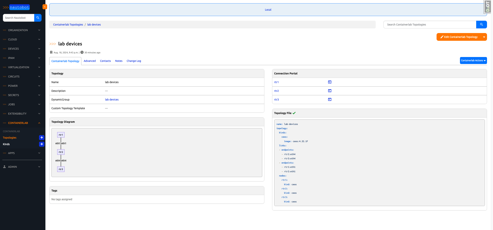
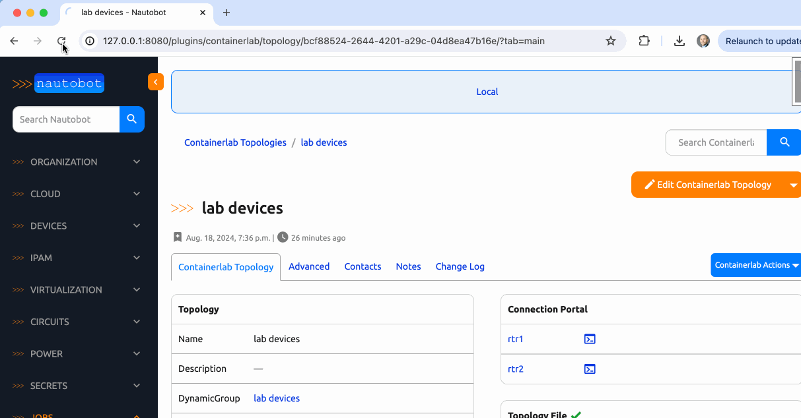
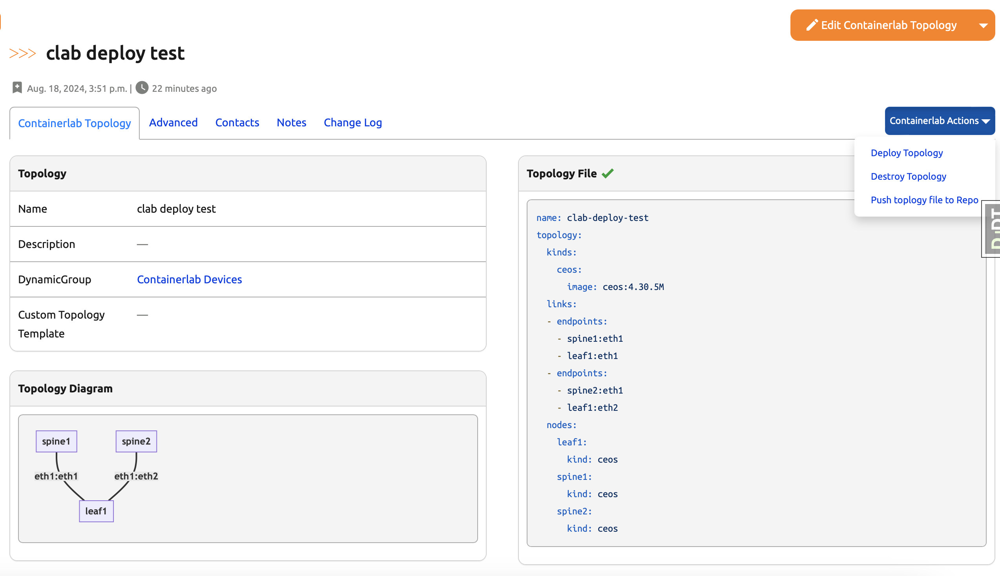
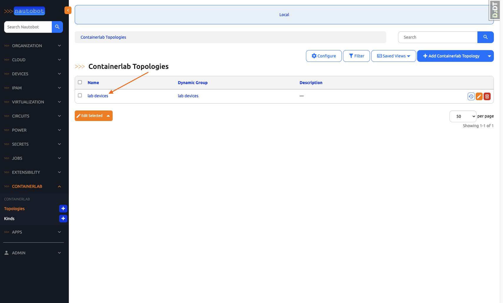
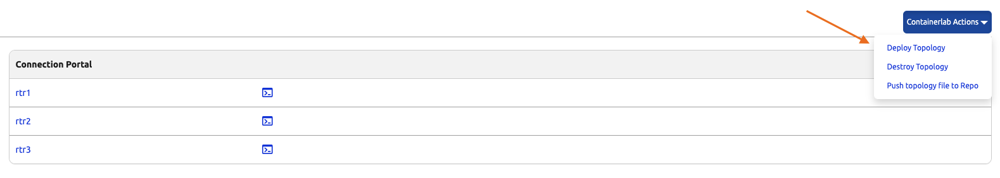
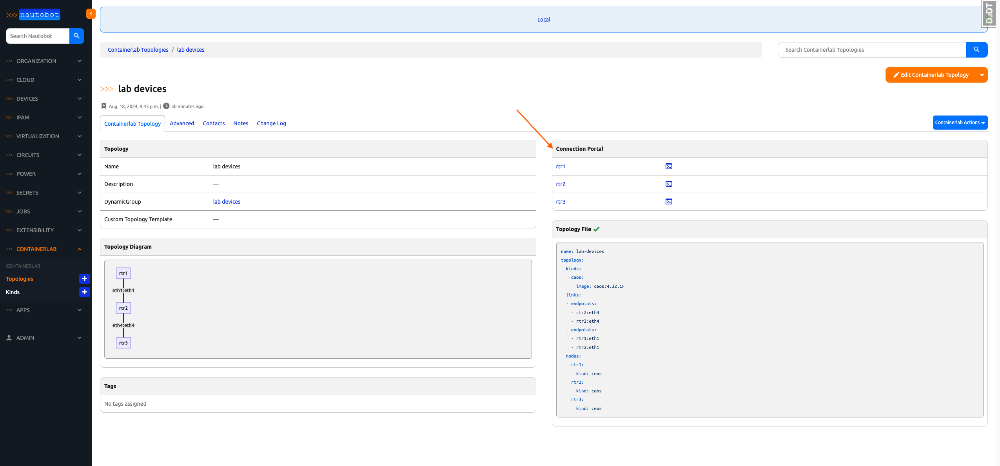

# Containerlab

<!--
Developer Note - Remove Me!

The README will have certain links/images broken until the PR is merged into `develop`. Update the GitHub links with whichever branch you're using (main etc.) if different.

The logo of the project is a placeholder (docs/images/icon-containerlab.png) - please replace it with your app icon, making sure it's at least 200x200px and has a transparent background!

To avoid extra work and temporary links, make sure that publishing docs (or merging a PR) is done at the same time as setting up the docs site on RTD, then test everything.
-->

<p align="center">
  <!--  -->
  
  <br>
  <!-- <a href="https://github.com/nautobot/nautobot-app-containerlab/actions"></a> -->
  <!-- <a href="https://docs.nautobot.com/projects/containerlab/en/latest/"></a> -->
  <!-- <a href="https://pypi.org/project/containerlab/"></a> -->
  <!-- <a href="https://pypi.org/project/containerlab/"></a> -->
  <br>
  An <a href="https://networktocode.com/nautobot-apps/">App</a> for <a href="https://nautobot.com/">Nautobot</a>.
</p>

## Overview

This Nautobot App allows you to model the topology of your Nautobot Devices and generate a network lab using [Containerlab](https://containerlab.dev/). The lab can then be deployed to a local machine for development or a remote AWS lab using Terraform (TODO).

Optionally, a [Remote Topology File](https://containerlab.dev/cmd/deploy/#remote-topology-files) can be retrieved from a GitHub or GitLab repository to deploy a shared container lab environment.

Optionally, you can configure with Guacamole to SSH to your devices.


## Screenshots

**Topology Detail**


**Guacamole Integration**


**Mermaid Diagram**


## Major Features

- Dynamically create Containerlab topology files
- Use the topology file to create a Docker-in-Docker Containerlab locally.
- Use the topology file to deploy ContainerLab into an AWX instance (WIP).
- SSH from your browser with Guacamole.
- Check topology validity using [jsonschema](https://json-schema.org/).

## Try it out!

<!-- The Quickstart guide to deploying a dev environment can be found [here]() -->

Download the Arista cEOS image `cEOS64-lab-4.32.1F.tar.xz` from [Arista's website](https://www.arista.com/en/support/software-download) and then run `docker import cEOS64-lab-4.32.1F.tar.xz ceos:4.32.1F` from the directory where this file was downloaded. Then you can proceed with the rest of the dev environment quick start below.

```bash
invoke build
invoke migrate start cli
nautobot-server generate_clab_test_data && exit
```

### Navigate to Lab Topology 

On the Nautobot Homepage, expand the "CONTAINERLAB" dropdown and click "Topologies".


Once on the list of topologies, click the `lab device` topology. 


Once on detail page, you have multiple boxes of information as well as a "Containerlab" actions button. This action button allows you to do the following:

- Deploy Containerlab topology from the presented topology file. 
- Destroy an already destroyed topology.
- Push the topology file to a git repo. 



Once a topology is deployed, you can connect to your devices via the "Connection Portal" table. All you need to do is click on the device's respective SSH symbol and a new tab will open dropping you into the device's CLI. 

> Note: You must first ensure you have Guacamole running by going through the [Guacamole](./docs/admin/guacamole.md) documentation.



## Hackathon Experience

 - The level of collaboration and expertise between the team was astounding. Everyone is so helpful and smart and it's awesome to see how much can get done when a group of like-minded people put their heads together. 


## Next Steps

Our team came up with so many great ideas to continue pushing this app's capabilities. Some worth noting include

- Capture Status of Containlerlab
- Start/Stop control of Containerlab and individual devices within the lab.
- Visualization Control (e.g pixel perfect)


On top of those ideas, there are more pressing ones that would need to be addressed to ensure a production version of this app is up to snuff. 

### Interface Mapping

Virtual images hardly ever match the amount/type of interfaces the physical device it's representing. Along with that, ensuring the appropriate management interface that ContainerLab expects to see exists needs to be taken into account. We discussed using custom fields on the interfaces to do the mapping and/or a find and replace on the actual config. 

### Seamless Connectivity to AWS deployed ContainerLab

Ensuring we can have a seamless connection to AWX deployed ContainerLab was something we didn't tackle for the MVP. It is more difficult than the local container implementation so, we were unable to get that incorporated in time. 